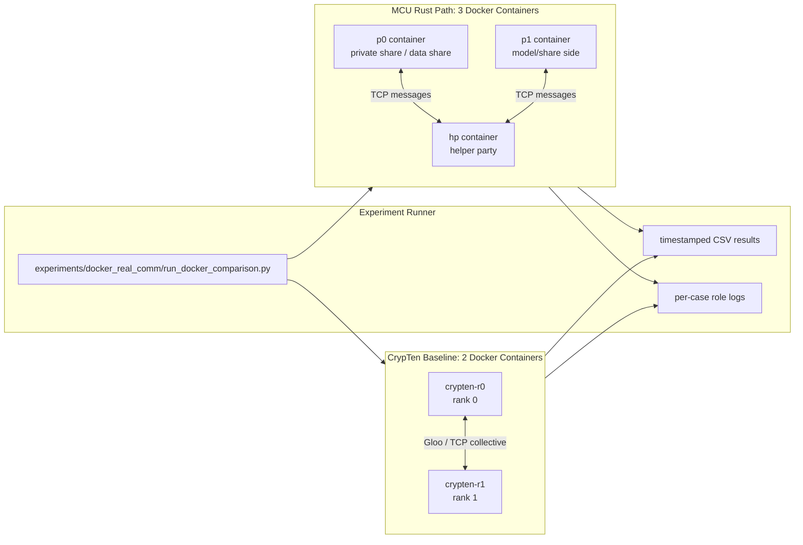
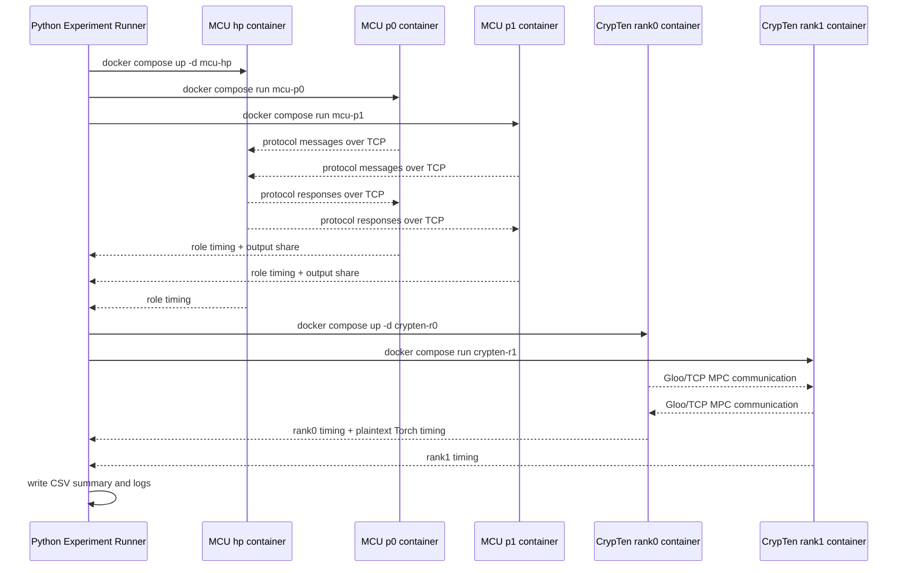
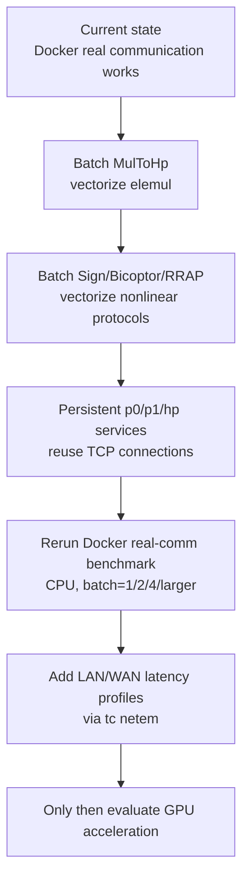

# MCU-Transformer Real-Communication Experiment Report

Date: 2026-06-24

## 1. Current Status

The current project has moved from single-process/thread simulation to a Docker-based real-communication benchmark path. The MCU Rust path now runs three independent roles, `p0`, `p1`, and `hp`, over TCP. The CrypTen baseline runs two independent ranks over PyTorch Gloo/TCP. Both paths are executed in Docker containers on the same host Docker bridge network.

The latest experiment results are stored in:

- `experiments/20260624_154028_docker_real_comm/summary.csv`
- `experiments/20260624_154028_docker_real_comm/docker_real_comm_comparison.csv`

The key result is that MCU is slower than CrypTen for most operators under the current real-communication implementation. The median `MCU / CrypTen` ratio is about `7.48x`; the fastest relative case is `softmax batch=1` at `0.73x`, and the slowest is `exp batch=4` at `34.00x`.

The new timing instrumentation shows that the slowdown is dominated by socket communication and blocking wait time, not local arithmetic.

## 2. Implemented System Architecture

### 2.1 MCU Rust Real-Communication Path

Implemented components:

- Rust socket communication abstraction in `mcu_rust/src/channel.rs`.
- Real tensor runner in `mcu_rust/src/bin/real_tensor.rs`.
- Real nonlinear runner in `mcu_rust/src/bin/real_nonlinear.rs`.
- Docker role entrypoint in `docker/mcu_entrypoint.sh`.
- MCU Docker image in `docker/Dockerfile.mcu`.

The MCU deployment uses three roles:

- `p0`: owns one share of private data.
- `p1`: owns the other share or model-side share depending on the protocol path.
- `hp`: helper party that performs protocol assistance but does not own plaintext inputs.

Current supported real-communication benchmark operators:

- Tensor operators: `elemul`, `matmul`
- Nonlinear operators: `exp`, `sigmoid`, `gelu`, `softmax`

The current implementation also records per-role timing:

- total role time
- socket send/recv time
- local non-socket time
- protocol time
- output write time
- message counts and byte counts

### 2.2 CrypTen Docker Baseline

Implemented components:

- CrypTen Docker image in `docker/Dockerfile.crypten`.
- CrypTen rank benchmark script in `docker/crypten_rank_bench.py`.
- Docker Compose services `crypten-r0` and `crypten-r1`.

CrypTen runs as two separate rank containers using:

- `WORLD_SIZE=2`
- `RANK=0/1`
- `DISTRIBUTED_BACKEND=gloo`
- `RENDEZVOUS=tcp://crypten-r0:29500`

The Docker image pins `torch==2.8.0+cpu` and installs `crypten==0.4.1` with `--no-deps` to avoid pip upgrading Torch to an incompatible CUDA build.

The CrypTen benchmark also records a plaintext Torch baseline for the same operator and shape on rank 0.

## 3. Architecture Diagram



## 4. Experiment Design

The experiment compares MCU and CrypTen on the same operator families and matched tensor shapes. The ratio is defined as:

```text
ratio = MCU median time / CrypTen median time
```

Batch sizes:

- `1`
- `2`
- `4`

Operators:

- `elemul`
- `matmul`
- `exp`
- `sigmoid`
- `gelu`
- `softmax`

Measurement method:

- MCU uses three Docker containers over TCP.
- CrypTen uses two Docker containers over Gloo/TCP.
- Each case is repeated 3 times.
- Median time is reported.
- MCU critical role is the slowest of `p0`, `p1`, and `hp`.
- Plaintext Torch timing is measured inside the CrypTen container on rank 0.

Command used:

```powershell
python experiments\docker_real_comm\run_docker_comparison.py --skip-build --repeat 3 --batches 1,2,4
```

## 5. Key Experimental Results

| Operator | Batch | MCU s | CrypTen s | MCU/CrypTen | Critical Role | MCU Comm % | HP Recv Msgs | HP Send Msgs |
|---|---:|---:|---:|---:|---|---:|---:|---:|
| elemul | 1 | 0.054539 | 0.007378 | 7.39x | p1 | 87.6% | 128 | 128 |
| matmul | 1 | 0.057207 | 0.007368 | 7.76x | p1 | 84.3% | 2 | 2 |
| exp | 1 | 0.236875 | 0.023378 | 10.13x | p1 | 98.8% | 12928 | 384 |
| sigmoid | 1 | 0.263188 | 0.094221 | 2.79x | p1 | 98.8% | 13056 | 512 |
| gelu | 1 | 0.263927 | 0.102376 | 2.58x | p0 | 98.9% | 13184 | 640 |
| softmax | 1 | 0.242056 | 0.332328 | 0.73x | p1 | 98.9% | 12960 | 512 |
| elemul | 4 | 0.058622 | 0.007314 | 8.01x | p0 | 91.3% | 512 | 512 |
| matmul | 4 | 0.059544 | 0.007866 | 7.57x | p1 | 85.0% | 2 | 2 |
| exp | 4 | 0.794446 | 0.023363 | 34.00x | p0 | 98.8% | 51712 | 1536 |
| sigmoid | 4 | 0.900507 | 0.098662 | 9.13x | p0 | 98.8% | 52224 | 2048 |
| gelu | 4 | 0.938755 | 0.101650 | 9.24x | p0 | 98.9% | 52736 | 2560 |
| softmax | 4 | 0.872043 | 0.325973 | 2.68x | p0 | 98.8% | 51840 | 2048 |

Full result table is available in `docker_real_comm_comparison.csv`.

## 6. Interpretation

The current bottleneck is communication granularity and synchronization, not raw arithmetic.

Evidence:

- For nonlinear operators, the critical MCU role spends about `98.8% - 98.9%` of its time in socket send/recv.
- `exp batch=4` sends/receives tens of thousands of messages at HP: `51712` received messages and `1536` sent messages.
- Plaintext Torch times are below one millisecond for these small shapes, while MPC paths are orders of magnitude slower.
- `matmul` already uses tensor-level messages on the HP side, with only `2` received and `2` sent HP messages, but it is still affected by Docker/TCP startup, blocking wait, serialization, and small-shape overhead.
- `elemul` still uses per-element multiplication messages, so message count grows linearly with tensor length.

Therefore, the main reason MCU is currently slower is not simply "TCP is slow"; it is that the current MCU protocol implementation sends too many small synchronous messages and has not yet reached CrypTen's tensor-level collective communication style.

## 7. Current Experiment Flow



## 8. Implemented Experiment Artifacts

Docker and runner files:

- `.dockerignore`
- `docker/Dockerfile.mcu`
- `docker/Dockerfile.crypten`
- `docker/docker-compose.mpc.yml`
- `docker/mcu_entrypoint.sh`
- `docker/crypten_rank_bench.py`
- `docker/README.md`
- `experiments/docker_real_comm/run_docker_comparison.py`

Rust real-communication and instrumentation files:

- `mcu_rust/src/channel.rs`
- `mcu_rust/src/bin/real_tensor.rs`
- `mcu_rust/src/bin/real_nonlinear.rs`

Latest experiment directory:

- `experiments/20260624_154028_docker_real_comm/`

## 9. Next Work Required

### 9.1 Protocol-Level Batching

Highest priority:

- Replace elementwise `MulToHp` loops with a true vector message protocol.
- Add batch/tensor message variants for Sign/Bicoptor/RRAP-related protocols.
- Make `exp`, `sigmoid`, `gelu`, and `softmax` operate on vectors or matrices instead of scalar-by-scalar protocol calls.

Expected impact:

- Reduce HP message counts from tens of thousands to a small number of tensor messages.
- Reduce socket wait time and syscall overhead.
- Make comparison closer to CrypTen's communication model.

### 9.2 Persistent Role Processes

The current experiment repeatedly starts containers for each case. This is acceptable for correctness and first benchmarking, but not ideal for fine-grained performance measurement.

Next implementation:

- Start `p0`, `p1`, and `hp` once.
- Keep TCP connections open.
- Send multiple benchmark requests through the same process.
- Separate one-time startup/connect time from steady-state protocol time.

Expected impact:

- Cleaner latency measurements.
- Less noise from Docker process startup and scheduling.

### 9.3 Communication Profiling

The current socket instrumentation is useful, but still coarse. It should be extended to:

- Separate active socket I/O from blocking wait time.
- Record per-protocol-round timing.
- Record message size histograms.
- Track HP-side `recv p0`, `recv p1`, `send p0`, `send p1` separately.

Expected impact:

- Identify exactly which protocol rounds dominate nonlinear operators.
- Show whether optimization should focus on round reduction, message merging, or role scheduling.

### 9.4 Fairness Improvements Against CrypTen

The current comparison is useful but not fully apples-to-apples.

Needed refinements:

- Run larger shapes where computation matters more.
- Report Docker bridge latency separately.
- Add optional `tc netem` profiles: localhost-like, LAN-like, WAN-like latency.
- Keep both MCU and CrypTen in persistent multi-process mode.
- Consider comparing both CPU and GPU paths separately.

### 9.5 GPU Acceleration

GPU should not be the immediate first fix, because current data shows communication dominates. GPU becomes useful after:

- tensor-level protocol batching is implemented;
- local arithmetic becomes a meaningful fraction of runtime;
- larger BERT-like tensor shapes are benchmarked.

For GPU support, likely work includes:

- using Rust CUDA bindings or moving local tensor arithmetic to a Python/PyTorch sidecar;
- keeping protocol communication on CPU while batching large arithmetic kernels on GPU;
- benchmarking CPU vs GPU after communication overhead is reduced.

## 10. Recommended Immediate Plan



Immediate engineering sequence:

1. Add vector/tensor message types for batched multiplication and nonlinear protocol steps.
2. Refactor nonlinear operators to call batch protocol functions.
3. Build a persistent benchmark server mode for MCU roles.
4. Rerun the same CSV experiment and compare message counts before/after.
5. Add network latency profiles after the local Docker baseline is stable.

## 11. Bottom Line

The project now has a working real multi-process benchmark path for both MCU Rust and CrypTen. The latest experiment demonstrates that MCU's current slowdown is overwhelmingly caused by communication granularity and protocol round structure. The next milestone is not GPU acceleration; it is tensor-level batching and persistent communication. Once message counts are reduced, the benchmark will be much closer to a fair comparison with CrypTen and will provide a better basis for BERT-level optimization.
