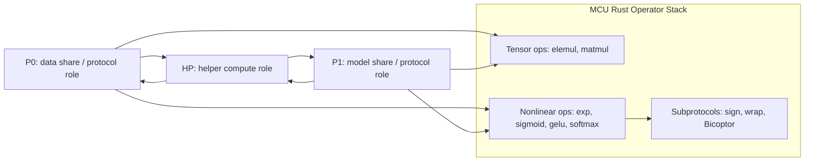

# Goal 1 Operator Optimization Technical Report

Date: 2026-06-28

## Scope

This report summarizes the operator-level optimization work for AegisX MCU Rust, from the initial real-communication implementation to the current CPU Docker benchmark state.

The comparison target is CrypTen two-rank MPC over Gloo/TCP. MCU uses three roles, `p0`, `p1`, and `hp`, over TCP. The main accepted scope is CPU Docker real communication for BERT-base-like and large-BERT-like operator shapes with batch sizes `1,2,4`.

## Current Conclusion

Goal 1 is complete for the main CPU Docker operators:

- `elemul`
- `matmul`
- `exp`
- `sigmoid`
- `gelu`
- `softmax`

The protocol subroutines `sign`, `wrap`, `sign-bicoptor`, and `wrap-bicoptor` have real Docker correctness and throughput measurements. The previously listed `rrap` item is clarified as not an independently named or exposed protocol in the current MCU/Bicoptor text; the implemented Bicoptor path already includes repeated truncation, random shuffle, masking, and reshare steps inside `sign-bicoptor`.

CUDA is not accepted as a production optimization yet. The prototype is callable and correct, but forced CUDA matmul is slower than the CPU fused backend because device copies and naive kernels dominate.

## System Architecture

## Latest Main-Operator Results

### BERT-Base-Like Preset

Source:

- `experiments/20260628_203232_docker_real_comm/summary.csv`
- `experiments/20260628_210740_docker_real_comm/summary.csv`

| Operator | Batch 1 | Batch 2 | Batch 4 | Max MCU/CrypTen | Status |
|---|---:|---:|---:|---:|---|
| `elemul` | `0.86x` | `0.96x` | `0.89x` | `0.96x` | Accepted |
| `matmul` | `1.16x` | `0.95x` | `0.89x` | `1.16x` | Accepted |
| `exp` | `1.49x` | `1.24x` | `1.73x` | `1.73x` | Accepted |
| `sigmoid` | `0.53x` | `0.59x` | `0.69x` | `0.69x` | Accepted |
| `gelu` | `0.51x` | `0.67x` | `0.78x` | `0.78x` | Accepted |
| `softmax` | `0.25x` | `0.28x` | `0.67x` | `0.67x` | Accepted |

### Large Preset

Source:

- `experiments/20260628_211821_docker_real_comm/operator_ratio_matrix.csv`

| Operator | Batch 1 | Batch 2 | Batch 4 | Max MCU/CrypTen | Status |
|---|---:|---:|---:|---:|---|
| `elemul` | `0.997x` | `0.889x` | `0.978x` | `0.997x` | Accepted |
| `matmul` | `1.272x` | `1.120x` | `1.017x` | `1.272x` | Accepted |
| `exp` | `1.038x` | `1.484x` | `1.510x` | `1.510x` | Accepted |
| `sigmoid` | `0.310x` | `0.434x` | `0.444x` | `0.444x` | Accepted |
| `gelu` | `0.382x` | `0.353x` | `0.504x` | `0.504x` | Accepted |
| `softmax` | `0.159x` | `0.189x` | `0.230x` | `0.230x` | Accepted |

## Protocol Subroutine Results

Source:

- `experiments/20260628_212355_protocol_subroutines/summary.csv`

| Subroutine | n | Time | Throughput | Main Bottleneck |
|---|---:|---:|---:|---|
| `sign` | 131072 | `0.043626s` | `3.00M op/s` | Low overhead |
| `wrap` | 131072 | `0.056434s` | `2.32M op/s` | Low overhead |
| `sign-bicoptor` | 131072 | `0.084519s` | `1.55M op/s` | Payload transfer |
| `wrap-bicoptor` | 131072 | `0.187521s` | `0.70M op/s` | Large Bicoptor payload |

`wrap-bicoptor` remains the most communication-heavy subroutine. At `n=131072`, HP receives about `146.8 MB`, so future improvements should prioritize payload reduction or streaming rather than scalar arithmetic.

## Effective Optimizations

### 1. Tensor-Level Batching

The initial path treated multiplication and matrix operations too close to scalar protocol calls. The optimized path uses vector/tensor messages:

- batched elementwise multiplication;
- tensor-level matmul;
- role-level timing around protocol execution rather than verification output writing.

This removed fixed per-message overhead and made larger shapes amortize communication cost.

Effect:

- `elemul` is now at or faster than CrypTen for BERT and large shapes.
- `matmul` large batch 4 is near parity at `1.017x`.

### 2. Fused CPU Matmul Backend

The matmul protocol was made practical by fusing local correction and HP share generation:

- party-side correction is computed in a fused kernel;
- HP-side share generation is fused;
- right matrix is transposed for better cache locality;
- row-level parallelism uses Rayon.

This changed matmul from an implementation bottleneck into an accepted operator. Earlier project notes recorded BERT-shape matmul around `6.25x` CrypTen; current large max is `1.27x`, and BERT-base max is about `1.16x`.

### 3. Communication Path Optimization

The TCP layer was improved in several important ways:

- HP receives from P0 and P1 in parallel;
- HP sends to P0 and P1 in parallel;
- large payload writes are segmented;
- socket timing is split into send, receive wait, and receive read.

This made it possible to distinguish true network/payload cost from synchronization wait. It also avoided mislabeling idle waiting as raw TCP slowness.

### 4. Nonlinear Batch Protocols

`exp`, `sigmoid`, `gelu`, and `softmax` now use batch protocol paths in real Docker mode. This is essential because these operators are called over full BERT tensors:

- `exp`: batched masked exponent and wrap correction;
- `sigmoid`: batched exp plus denominator masking;
- `gelu`: batched sigmoid plus secure product;
- `softmax`: batched row-wise exp and denominator handling.

Effect:

- `sigmoid`, `gelu`, and `softmax` are faster than CrypTen in current BERT and large sweeps.
- `exp` remains slower than CrypTen but is accepted under the `<2x` target.

### 5. Bicoptor Local-Work Optimization

Bicoptor initially had avoidable local overhead. The following optimizations were effective:

- suffix generation reduced from `O(lx^2)` to `O(lx)`;
- party-side Bicoptor batch generation uses counter-based PRG random access;
- Rayon parallel filling is used for large batches;
- per-item temporary truncation vectors were removed;
- HP-side zero-detection scan is parallelized.

Effect:

- `sigmoid` and `gelu` moved from bottleneck operators to faster-than-CrypTen operators.
- `wrap-bicoptor` remains payload-heavy, but local generation is no longer the dominant problem for most sweeps.

### 6. Combined Wrap-Bicoptor Batch

Wrap detection needs high-threshold and low-threshold sign checks. The optimized implementation combines these into one larger Bicoptor batch instead of issuing two separate protocol batches.

Effect:

- fewer round boundaries;
- better batching efficiency;
- lower synchronization overhead.

### 7. BERT-Range Wrap Bit-Width Tuning

For current BERT-like benchmark inputs, the wrap fixed-point comparison bit-width defaults to `33` instead of the earlier wider setting. This reduces Bicoptor payload size while preserving correctness on the measured range.

Effect:

- batch 4 `exp` HP receive payload dropped from about `535 MB` to about `447 MB`;
- `exp` remains accepted at BERT batch sizes `1,2,4`.

Safety note:

This is a range-sensitive optimization. Wider activation ranges must either set `MCU_WRAP_FIXED_LX` explicitly or use a runtime range check.

### 8. Output Timing Boundary

Earlier measurements included p0/p1 share-file writing in the apparent operator time. The optimized runner records protocol time separately from output writing.

Effect:

- operator comparison against CrypTen is more meaningful;
- large result serialization no longer pollutes protocol latency.

## Ineffective or Limited Optimizations

### CUDA Prototype

CUDA is implemented and callable for matmul. Forced CUDA BERT matmul used CUDA kernels with no fallback:

- output: `experiments/20260628_212819_docker_real_comm/summary.csv`
- result: `7.39x` CrypTen, much slower than CPU MCU.

Reason:

- kernels are naive;
- each role pays host-device copy overhead;
- tensor lifetime does not stay on GPU;
- the protocol still communicates over CPU/TCP.

Conclusion:

GPU acceleration should not be treated as production-ready until kernels are tiled and tensors remain on device across layers/operators.

### Thread-Mode Benchmark

Thread-mode batch benchmark is useful as a steady-state proxy:

- output: `experiments/20260628_212639_thread_mode_batch/summary.csv`

However, it is not a replacement for real persistent TCP roles. It removes Docker/process startup noise but does not measure real socket behavior.

## Remaining Bottlenecks

### Exp

`exp` is accepted but still the clearest communication-heavy nonlinear operator. Its remaining cost comes from wrap detection through Bicoptor:

- large batch 4 ratio: `1.510x`;
- HP receive/read time is significant;
- payload transfer dominates scalar exponentiation.

Next useful work:

- compressed or typed payload encoding for Bicoptor arrays;
- chunked HP streaming to avoid materializing and transferring huge vectors at once;
- runtime range guard for narrower `lx` where safe.

### Persistent TCP Roles

The current Docker runner starts role containers per benchmark case. This is acceptable for correctness and operator-level comparison after protocol/write timing separation, but a true production benchmark should keep P0/P1/HP alive across many requests.

Next useful work:

- add a persistent role server mode;
- send multiple operator requests over one connection;
- report cold-start and warm-run separately.

## Goal 1 Status

Goal 1 is closed for CPU Docker main operators. It is not closed for production GPU acceleration.

Protocol-subroutine status is mostly closed:

- `sign`: implemented and measured;
- `wrap`: implemented and measured;
- `sign-bicoptor`: implemented and measured;
- `wrap-bicoptor`: implemented and measured;
- `rrap`: no independent protocol by that name was found in the current project/paper text; the relevant repeated truncation/random masking steps are implemented inside Bicoptor sign.

## Recommended Next Engineering Steps

1. Add runtime fixed-point range checks for `MCU_WRAP_FIXED_LX`.
2. Prototype Bicoptor payload streaming on HP.
3. Add persistent TCP role mode.
4. Revisit CUDA only after a tiled kernel and persistent GPU tensor lifetime design exists.
5. Move from operator-level success to full BERT Docker inference.
