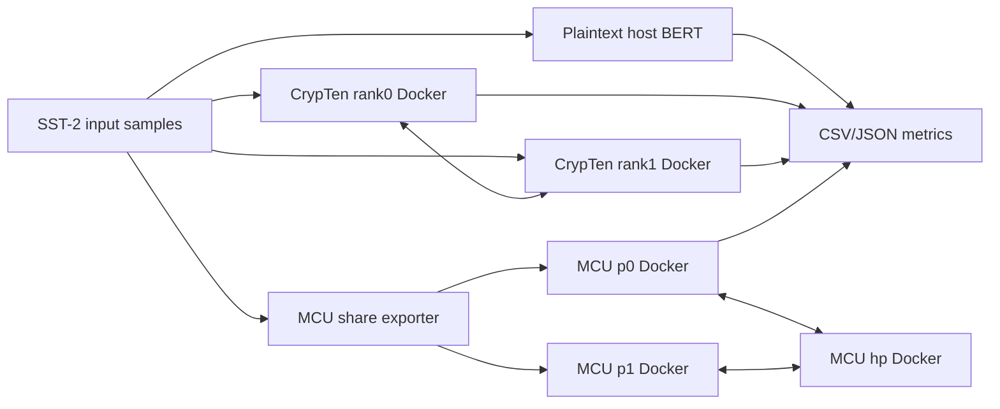

# Goal 2 BERT Docker Testing Technical Report

Date: 2026-06-29

## Scope

This report records the current Goal 2 BERT Docker state. The project now has a numerical end-to-end BERT benchmark for:

- plaintext HuggingFace/PyTorch BERT;
- CrypTen two-rank Docker BERT over Gloo/TCP;
- MCU three-role Docker BERT over p0/p1/hp TCP.

The MCU path is a numerical end-to-end baseline, not a final secure BERT implementation. It still uses HP-clear bridges for rescale, fixed/real conversion, LayerNorm, pooler tanh, and final probability reveal.

## Architecture

## Implemented

- CrypTen Docker `bert_full` baseline through `CRYPTEN_OP=bert_full`.
- MCU Docker BERT session runner:
  - `mcu_rust/src/bin/bert_session.rs`
  - `experiments/docker_bert_full/run_mcu_bert_session_smoke.py`
  - `experiments/docker_bert_full/run_mcu_bert_session_docker.py`
  - `docker/Dockerfile.mcu.bert_session`
- MCU real_io share export:
  - embedding shares;
  - attention mask;
  - Q/K/V/O/FFN weights;
  - Q/K/V/O/FFN biases;
  - LayerNorm gamma/beta;
  - pooler weight/bias;
  - classifier weight/bias.
- MCU full numerical state flow:
  - Q/K/V projections with bias;
  - attention scores, scaling, mask, softmax feedback, value matmul;
  - O projection, residual, LayerNorm;
  - FFN in, GeLU feedback, FFN out, residual, LayerNorm;
  - pooler dense, tanh, classifier, logits, probabilities, predictions.
- Accuracy comparison script:
  - `experiments/docker_bert_full/compare_mcu_docker_accuracy.py`
  - writes `per_sample.csv`, `summary.csv`, and `results.json`.

## Key Fixes

Two fixes were necessary for numerical fidelity:

- Q/K/V biases were missing from the MCU export/session path. They are now exported from the HF checkpoint and added as local share additions after Q/K/V matmuls.
- The HF attention mask constant `-10000` was invalid inside the MCU real exponential protocol because that protocol works modulo `MOD=256`. It wrapped instead of suppressing padding. MCU now uses a protocol-domain-safe `-80`, which makes masked logits effectively zero after softmax without crossing the protocol range.

## Latest Results

Main artifacts:

- CrypTen Docker native baseline: `experiments/20260628_223612_docker_bert_full/summary.csv`
- MCU Docker run: `experiments/20260629_180301_mcu_bert_session_docker/summary.csv`
- MCU-vs-plaintext accuracy: `experiments/20260629_180736_mcu_bert_accuracy/summary.csv`
- Combined Goal2 summary: `experiments/20260629_180900_goal2_docker_bert_comparison/summary.csv`

| Mode | Status | Accuracy | Avg Latency | Top-1 Match vs Plain | Mean JS |
|---|---|---:|---:|---:|---:|
| plaintext_host | ok | `1.00` | `0.0486s/sample` | `1.00` | `0` |
| crypten_docker native | ok | `0.90` | `11.6562s/sample` | `0.90` | `4.16e-3` |
| mcu_docker hp_clear | ok | `1.00` | `6.6800s/sample` | `1.00` | `2.49e-4` |

MCU role timing for the latest Docker run:

| Role | Total | Comm | Local | Send Bytes | Recv Bytes |
|---|---:|---:|---:|---:|---:|
| hp | `66.76s` | `56.08s` | `10.69s` | `1.05GB` | `9.55GB` |
| p0 | `66.80s` | `27.87s` | `38.93s` | `4.78GB` | `0.53GB` |
| p1 | `66.76s` | `27.69s` | `39.08s` | `4.78GB` | `0.53GB` |

Interpretation:

- The numerical Goal2 Docker benchmark is complete for the 10-sample SST-2 check.
- MCU is faster than the current CrypTen native Docker baseline on this benchmark: about `0.57x` CrypTen latency by average per-sample time.
- MCU is also closer to plaintext than the current CrypTen native baseline on this 10-sample check.
- The result should not be presented as final secure BERT because HP-clear operations still reconstruct sensitive intermediate values.

## Security Boundary

Current acceptable/public or already-known boundaries:

- tokenization and sample text preparation happen outside MPC;
- attention mask is currently treated as public metadata;
- final logits/probabilities are revealed for evaluation.

Current security blockers in MCU:

- HP-clear matmul rescale reconstructs fixed-point matmul outputs at HP.
- HP-clear fixed/real conversion reconstructs attention scores and FFN activations at HP.
- HP-clear LayerNorm reconstructs hidden rows and LayerNorm parameters at HP.
- HP-clear pooler tanh reconstructs pooler inputs/outputs at HP.
- HP-clear final softmax reveal reconstructs classifier logits at HP.

Current CrypTen caveats:

- both ranks load the model checkpoint in the current engineering baseline;
- legacy 2Quad mode reconstructs scores before `two_quad`;
- native LayerNorm and some surrounding steps still contain reconstruction points in the local implementation.

## Storage Note

Docker Desktop WSL data was moved from `C:\Users\31248\AppData\Local\Docker\wsl` to project-local ignored storage:

`F:\AI_Agent\MCU-transformer\.local\docker-desktop-data\wsl`

A junction remains at the original C: path. `.local/` is ignored by git and also holds project-local pip/HuggingFace/Torch/temp cache directories.

## Next Work

1. Replace HP-clear rescale with a secure batched truncation/rescale protocol.
2. Replace HP-clear fixed/real conversion or keep nonlinear feedback fully in a secure fixed-point domain.
3. Replace HP-clear LayerNorm with a secure LayerNorm approximation/protocol.
4. Replace HP-clear pooler tanh and final classifier reveal with a threat-model-approved output policy.
5. Add a reusable warm Docker service API for repeated inference requests instead of one container orchestration per benchmark run.
