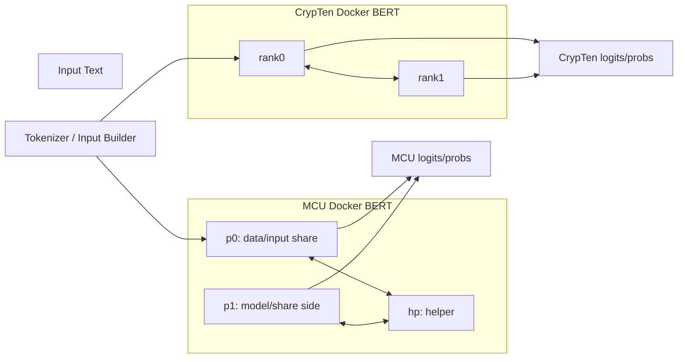

# AegisX Project Progress Tracking

Date: 2026-06-28

## 0. Project Direction

AegisX aims to build a real multi-party secure Transformer inference system based on the MCU protocol family. The final system should support three comparable inference paths:

- Plaintext inference: standard HuggingFace/PyTorch BERT.
- CrypTen inference: two-party MPC baseline over real Docker communication.
- MCU inference: three-role `p0 / p1 / hp` secure computation over real Docker communication.

The project should not only prove correctness of isolated protocols, but also show practical efficiency at operator level, end-to-end BERT level, and frontend demonstration level.

## 1. Current Baseline

### Implemented

- Project progress tracking rule:
  - `.cursor/rules/project-progress-tracking.mdc`
  - requires reading the relevant progress section before work and updating this document after work
- MCU real Docker communication for `p0`, `p1`, and `hp` over TCP.
- CrypTen Docker baseline using two ranks over Gloo/TCP.
- Operator-level Docker comparison for:
  - `elemul`
  - `matmul`
  - `exp`
  - `sigmoid`
  - `gelu`
  - `softmax`
- Batch protocols for nonlinear operators.
- Communication instrumentation:
  - `send_s`
  - `recv_s`
  - `recv_wait_s`
  - `recv_read_s`
  - message counts
  - byte counts
- Tensor matmul CPU optimization:
  - fused party correction
  - fused HP matmul share
  - Rayon parallelism
  - right-matrix transpose for cache locality
- Experimental output in timestamped `experiments/` directories.
- Full BERT comparison artifacts:
  - plaintext BERT
  - CrypTen Docker 12L native baseline
  - MCU Docker 12L p0/p1/hp numerical baseline
  - earlier Python-level CrypTen/MCU-Rust paths

### Important Limitation

The current MCU full BERT Docker benchmark is numerically end-to-end and uses real p0/p1/hp Docker communication, but it is not yet final secure BERT because several steps still use HP-clear numerical bridges.

## 2. Main Goal 1: Operator-Level Optimization

### Goal

Optimize parallel computation and communication for every operator so that MCU is close to or faster than CrypTen whenever the MCU three-party structure does not impose an unavoidable theoretical disadvantage.

### Target Operators

- `elemul`
- `matmul`
- `exp`
- `sigmoid`
- `gelu`
- `softmax`
- protocol subroutines:
  - `sign`
  - `wrap`
  - `bicoptor`
  - `rrap`

### Current Status

| Area | Status | Notes |
|---|---|---|
| Tensor matmul protocol | Accepted on CPU Docker | BERT and large preset matmul are within the current `<2x` target; large batch 4 is near parity. |
| Nonlinear batch protocols | Implemented | Batch message paths exist for exp/sigmoid/gelu/softmax. |
| Communication timing split | Implemented | `recv_wait_s` proves much of apparent comm time is synchronization wait. |
| CPU fused tensor backend | Implemented for matmul | Party correction and HP matmul now use fused CPU kernels. |
| Tensor output timing boundary | Implemented | Protocol timing no longer counts p0/p1 verification share file writing on the critical path. |
| Bicoptor suffix generation | Optimized | Replaced per-item O(lx^2) suffix-sum construction with O(lx) construction. |
| Bicoptor batch generation | Optimized | Party-side Bicoptor message generation now uses counter-based PRG access and Rayon parallel filling. |
| CUDA backend | Prototype only, not production | Correct and callable, but forced CUDA matmul is much slower than CPU Docker in current measurements. |
| Persistent role process | Not implemented | Thread-mode batch benchmark exists as a steady-state proxy; real persistent TCP role process still open. |
| Operator-level pass/fail thresholds | Defined for current CPU Docker scope | BERT-base and large batch `1,2,4` main operators are recorded below. |

### Latest Operator Acceptance Snapshot

Date: 2026-06-28

Scope:

- Real Docker communication.
- MCU: three roles, `p0 / p1 / hp`, TCP.
- CrypTen: two ranks, Gloo/TCP.
- Preset: BERT-base-like operator shapes, batch sizes `1,2,4`.
- MCU protocol time excludes verification share file writing; write time is still reported separately.

Experiment outputs:

- Full operator matrix: `experiments/20260628_203232_docker_real_comm/summary.csv`
- Pivot ratio matrix: `experiments/20260628_203232_docker_real_comm/operator_ratio_matrix.csv`
- Exp follow-up after wrap bit-width and HP scan optimization: `experiments/20260628_205346_docker_real_comm/summary.csv`
- Exp follow-up after reducing BERT-range wrap bit-width to `33`: `experiments/20260628_210740_docker_real_comm/summary.csv`
- Large preset full operator matrix: `experiments/20260628_211821_docker_real_comm/summary.csv`
- Large preset pivot ratio matrix: `experiments/20260628_211821_docker_real_comm/operator_ratio_matrix.csv`
- Protocol subroutine benchmark and gap table: `experiments/20260628_212355_protocol_subroutines/summary.csv`
- Thread-mode batch steady-state proxy: `experiments/20260628_212639_thread_mode_batch/summary.csv`
- Forced CUDA matmul evaluation: `experiments/20260628_212819_docker_real_comm/summary.csv`
- Goal 1 technical report: `docs/20260628_goal1_operator_optimization_report.md`
- Tensor/key operators: `experiments/20260628_194149_docker_real_comm/summary.csv`
- Nonlinear operators after Bicoptor parallelization: `experiments/20260628_202325_docker_real_comm/summary.csv`
- Earlier toy full matrix: `experiments/20260628_192101_docker_real_comm/summary.csv`

| Operator | Batch 1 | Batch 2 | Batch 4 | Max | Status | Main reason |
|---|---:|---:|---:|---:|---|---|
| `elemul` | `0.86x` | `0.96x` | `0.89x` | `0.96x` | Accepted | MCU is at or faster than CrypTen for BERT-like batches. |
| `matmul` | `1.16x` | `0.95x` | `0.89x` | `1.16x` | Accepted | Meets CPU Docker target `<2x`; stretch target `<1.2x` is also met in this sweep. |
| `exp` | `1.49x` | `1.24x` | `1.73x` | `1.73x` | Accepted | BERT-range wrap bit-width `33` reduces Bicoptor payload while preserving correctness on the benchmark range. |
| `sigmoid` | `0.53x` | `0.59x` | `0.69x` | `0.69x` | Accepted | Bicoptor parallelization makes MCU faster than CrypTen in this sweep. |
| `gelu` | `0.51x` | `0.67x` | `0.78x` | `0.78x` | Accepted | MCU faster than CrypTen in this sweep. |
| `softmax` | `0.25x` | `0.28x` | `0.67x` | `0.67x` | Accepted | Batched path is faster than CrypTen for BERT-like rows. |

Interpretation:

- `elemul`, `matmul`, `exp`, `sigmoid`, `gelu`, and `softmax` are accepted for BERT-like batch sizes `1,2,4`.
- `exp` was the only non-accepted operator in the first full sweep, but follow-up optimization brought it below `2x` CrypTen for batch sizes `1,2,4`.
- The previous `sigmoid/gelu` bottleneck was resolved by counter-based parallel Bicoptor generation; `exp` is accepted but remains the clearest communication-heavy nonlinear operator.
- The `large` preset sweep is complete for main operators; all six are accepted under the CPU Docker `<2x` target.

### Subgoals

#### 1.1 Establish Operator Benchmark Matrix

Status: Complete for current CPU Docker main-operator scope; protocol subroutine naming clarified

Tasks:

- Define standard shapes:
  - toy: small correctness smoke test
  - BERT-base: `seq=128`, `hidden=768`, `heads=12`, `ffn=3072`
  - large: `seq=128`, `hidden=1024`, `heads=16`, `ffn=4096`
- Define batch sizes:
  - `1`
  - `2`
  - `4`
  - optional stress tests: `8`, `16`
- For each operator, record:
  - MCU median time
  - CrypTen median time
  - plaintext Torch median time
  - `MCU / CrypTen`
  - `MCU / Plain`
  - `CrypTen / Plain`
  - communication breakdown
  - local compute breakdown
  - correctness error

Acceptance:

- Every operator has at least one toy, one BERT-base, and one larger-shape benchmark.
- Every benchmark row includes correctness verification.
- CSV output is generated under `experiments/<timestamp>_.../`.

Latest completion note:

- Main operators now have BERT-base and large preset Docker results for batch sizes `1,2,4`.
- Protocol subroutines `sign`, `wrap`, `sign-bicoptor`, and `wrap-bicoptor` have MCU real-Docker throughput and correctness rows.
- No independent `rrap` protocol/API was found in the current project or extracted paper text. The relevant repeated truncation, random shuffle, masking, and reshare steps are implemented inside Bicoptor sign and measured through `sign-bicoptor` / `wrap-bicoptor`.

#### 1.2 Matmul Optimization

Status: Accepted for BERT-base and large CPU Docker; CUDA production path blocked

Completed:

- Tensor-level matmul protocol.
- Fused CPU correction kernel for party side.
- Fused CPU HP share kernel.
- Parallel row-level execution via Rayon.
- Right-matrix transpose for better memory locality.
- Communication optimization:
  - HP parallel receive.
  - HP parallel send.
  - large payload segmented writes.
- Protocol timing excludes verification share file writing.

Latest result:

- BERT-base batch=1 shape `[128,768]x[768,768]`: accepted under `<2x`.
- Large preset max across batch sizes `1,2,4`: `1.27x`.
- Forced CUDA BERT matmul used CUDA kernels with no fallback, but was `7.39x` CrypTen and much slower than CPU MCU.

Remaining:

- Add blocked/tiled matmul kernel instead of only transposed row dot products.
- Tune `MCU_CPU_PAR_MIN_OPS` by shape.
- CUDA production path needs redesigned kernels and persistent device tensors before it is worth pursuing further.
- Explore persistent GPU workspace only after end-to-end tensor lifetime can stay on device.

Acceptance:

- BERT-base matmul should be at most `2x` CrypTen on CPU Docker.
- Stretch target: BERT-base matmul should be at most `1.2x` CrypTen.
- Any unavoidable gap must be explained by protocol traffic or three-party structure, not implementation overhead.

#### 1.3 Nonlinear Operator Optimization

Status: Accepted for BERT-base and large batch sizes `1,2,4`

Tasks:

- Re-run full nonlinear matrix after communication optimization.
- Identify whether bottleneck is:
  - message count
  - `recv_wait_s`
  - local nonlinear computation
  - HP fan-in/fan-out
- Ensure `exp`, `sigmoid`, `gelu`, `softmax` use fully batched paths in real Docker mode.
- Add fused batch execution for common BERT patterns:
  - attention softmax over all heads/rows
  - FFN GeLU over full hidden tensor

Completed:

- Real Docker mode uses batched paths for `exp`, `sigmoid`, `gelu`, and `softmax`.
- Bicoptor suffix-sum generation was reduced from O(lx^2) to O(lx).
- Nonlinear protocol timing no longer includes final output string formatting and verification-file writing.
- Party-side Bicoptor batch generation now uses counter-based PRG random access and Rayon parallel filling.
- `wrap_bicoptor_batch` combines hi/lo sign checks into one larger Bicoptor batch.
- Wrap fixed-point comparison bit-width defaults to `33` for the current BERT-like benchmark range, with `MCU_WRAP_FIXED_LX` override for wider numeric ranges.
- HP-side Bicoptor zero-detection scan is parallelized for large batches.
- Party-side Bicoptor value generation no longer allocates a temporary truncation vector for every item.
- `exp` batch PRG/share generation has an optional counter-based parallel path controlled by `MCU_EXP_PAR_MIN`, but it is not enabled for BERT batch sizes `1,2,4` by default because Docker CPU thread scheduling and memory pressure made it slower in measurement.

Latest result:

- `softmax`: accepted with max `0.67x` CrypTen across batch sizes `1,2,4`.
- `gelu`: accepted with max `0.78x` CrypTen across batch sizes `1,2,4`.
- `sigmoid`: accepted with max `0.69x` CrypTen across batch sizes `1,2,4`.
- `exp`: accepted with max `1.73x` CrypTen across batch sizes `1,2,4`.
- Large preset latest max ratios:
  - `exp`: `1.51x`
  - `sigmoid`: `0.44x`
  - `gelu`: `0.50x`
  - `softmax`: `0.23x`

Current bottleneck:

- The former party-side Bicoptor/wrap generation bottleneck is largely resolved for `sigmoid` and `gelu`.
- Standalone `exp` still has a structural wrap-detection dependency and sends large Bicoptor payloads. In the latest batch=4 run, HP received about `447 MB`, down from about `535 MB` before the `lx=33` tuning; the remaining gap is mainly payload transfer plus synchronization, not scalar `exp()` compute.
- Remaining risk is numeric-range generality for `lx=33`; wider model activation ranges must use `MCU_WRAP_FIXED_LX` or an explicit range check.

Acceptance:

- `softmax` should remain faster than CrypTen for BERT-like rows if current trend holds.
- `sigmoid` and `gelu` should be close to or faster than CrypTen on BERT-like tensors.
- `exp` should be investigated separately because it may carry more protocol-specific communication.

#### 1.4 Elemul and Low-Level Multiplication

Status: Accepted for BERT-base batch=1; small-shape overhead still high

Tasks:

- Confirm `elemul` uses vector protocol everywhere.
- Benchmark larger tensor lengths where Docker startup and fixed overhead are amortized.
- Add persistent role benchmark to measure steady-state elementwise throughput.

Latest result:

- BERT-base batch=1 length `[98304]`: MCU/CrypTen = `1.13x`.
- Toy shapes remain misleading because fixed Docker/process synchronization dominates.

Acceptance:

- For large tensors, `elemul` should approach CrypTen throughput unless three-party HP fan-in/fan-out dominates.
- If slower, report whether gap comes from bytes, sync wait, or local arithmetic.

#### 1.5 Theoretical Gap Analysis

Status: Implemented for measured operators; `rrap` treated as Bicoptor-internal terminology unless a separate paper definition is supplied

Tasks:

- For each operator, write a short analysis of expected communication:
  - number of parties
  - rounds
  - bytes sent by p0/p1/hp
  - critical path
- Mark each gap as:
  - implementation gap
  - protocol/architecture gap
  - measurement artifact

Acceptance:

- Every operator benchmark has a matching explanation for any `MCU / CrypTen > 1.5x`.

Latest output:

- Gap table: `experiments/20260628_212355_protocol_subroutines/operator_theoretical_gap.csv`
- Current `>1.5x` case is mainly `exp` at large batch 4 (`1.51x`), explained by Bicoptor payload transfer and HP receive/read time.
- The earlier `rrap` checklist item has been clarified: no standalone `rrap` definition was found locally, and the implemented Bicoptor sign already covers the repeated truncation/randomization/reshare path that was being referenced.

## 3. Main Goal 2: Full BERT Docker Inference

Decision status: Closed as Goal2 v1 on 2026-06-29. The completed scope is numerical end-to-end Docker BERT inference and CrypTen comparison. Final secure replacement of HP-clear bridges is intentionally deferred to a later security-focused goal.

### Goal

Implement full BERT inference launched through Docker and compare end-to-end inference efficiency against CrypTen two-party Docker inference. The target is for MCU Docker inference to reach or exceed CrypTen two-party inference efficiency.

### Current Status

| Area | Status | Notes |
|---|---|---|
| Python full BERT benchmark | Implemented | Compares plaintext, CrypTen, MCU-Rust extension. Not real Docker communication. |
| MCU Docker full BERT | Goal2 v1 complete | `bert_session` runs persistent p0/p1/hp Docker TCP 12-layer SST-2 BERT with exported embedding, attention mask, Q/K/V/O/FFN weights, all encoder biases, LayerNorm params, pooler, classifier, logits, and probabilities. HP-clear bridges make this a numerical baseline, not a final secure implementation. |
| CrypTen Docker full BERT | Baseline implemented | `CRYPTEN_OP=bert_full` runs two Docker ranks over Gloo/TCP with embedded SST-2 checkpoint. Native nonlinear path is the correctness baseline; legacy 2Quad remains optional. |
| BERT real weights | Available | `bert-base-uncased` and SST-2 checkpoint exist locally. |
| Frontend BERT comparison | Partially implemented | Uses existing benchmark JSON, not real Docker inference service. |

Latest output:

- Technical report: `docs/20260628_goal2_bert_docker_testing_report.md`
- CrypTen native full-path baseline: `experiments/20260628_223612_docker_bert_full/summary.csv`
- CrypTen native result: 10 samples, 12 layers, max sequence length 16. Plaintext host avg `0.0486s/sample`, CrypTen Docker native avg `11.6562s/sample`, rank-level full run about `117.8s`, accuracy/top-1 agreement `0.90`, mean JS `4.16e-3`.
- CrypTen legacy 2Quad result: `experiments/20260628_223028_docker_bert_full/summary.csv`, 10 samples, avg `2.0374s/sample`, accuracy/top-1 agreement `0.60`, mean JS `1.77e-2`.
- MCU numerical fix and final Goal2 run:
  - fixed missing Q/K/V bias export and consumption;
  - changed MCU attention mask penalty from HF-style `-10000` to protocol-domain-safe `-80`, because the real exponential protocol works modulo `MOD=256` and `-10000` wrapped instead of masking padding;
  - local validation: `experiments/20260629_175452_mcu_bert_session_smoke/summary.csv`;
  - Docker validation: `experiments/20260629_180301_mcu_bert_session_docker/summary.csv`;
  - accuracy report: `experiments/20260629_180736_mcu_bert_accuracy/summary.csv`;
  - combined Goal2 comparison: `experiments/20260629_180900_goal2_docker_bert_comparison/summary.csv`.
- MCU Docker result: 10 samples, 12 layers, max sequence length 16, real p0/p1/hp Docker TCP, critical role `66.80s`, avg `6.68s/sample`, accuracy/top-1 agreement with plaintext `1.00`, mean JS `2.49e-4`.
- Current MCU/CrypTen native latency ratio is about `0.57x` by average per-sample time (`6.68s / 11.66s`), while MCU has better top-1 agreement on this 10-sample check.
- Storage update: CrypTen image now embeds only `checkpoints/bert-sst2`, avoiding F: drive model bind-mount failures and repeated C: temp model staging.
- Storage migration update: Docker Desktop WSL data was moved from `C:\Users\31248\AppData\Local\Docker\wsl` to project-local ignored storage `F:\AI_Agent\MCU-transformer\.local\docker-desktop-data\wsl`, with a junction left at the original C: path. C: free space increased from about `8 GB` to about `76 GB`, Docker images remained visible, and `.local/` is ignored by git. Project-local cache directories were also created for pip/HuggingFace/Torch/temp.

### Required Architecture



### Subgoals

#### 2.1 CrypTen Docker `bert_full`

Status: Baseline implemented, native path accepted as current correctness baseline

Tasks:

- Completed: `docker/crypten_rank_bench.py` supports `CRYPTEN_OP=bert_full`.
- Completed: CrypTen image embeds the SST-2 checkpoint and no longer needs model bind mounts for the default run.
- Completed: fixed input JSON is supported.
- Completed: output includes latency, prediction, probability vector, accuracy inputs, and security profile.
- Completed: added `CRYPTEN_BERT_NONLINEAR=native` to improve agreement with plaintext.
- Remaining: remove plaintext/reconstruction points and reduce native-mode latency.

Acceptance:

- Met: `docker compose` can run `crypten-r0` and `crypten-r1` for `bert_full` with embedded checkpoint.
- Met: results are written to shared output as JSON and CSV by `experiments/docker_bert_full/run_docker_bert_comparison.py`.
- Partially met: native mode reaches `0.90` top-1 agreement on the current 10-sample check, but still has divergence from plaintext and is much slower than legacy 2Quad.

#### 2.2 MCU Docker Full BERT Session

Status: Numerical end-to-end Docker benchmark implemented; final secure protocols still open

Tasks:

- Completed: persistent local and Docker p0/p1/hp BERT sessions.
- Completed: real_io share export for input embedding, attention mask, Q/K/V/O/FFN weights, Q/K/V/O/FFN biases, LayerNorm params, pooler, classifier, and labels.
- Completed: full numerical state flow:
  - embedding/input preparation
  - Q/K/V/O linear projections with Q/K/V/O biases
  - attention score matmul
  - softmax feedback
  - value matmul
  - residuals and LayerNorm
  - FFN in/out and GeLU feedback
  - pooler tanh
  - classifier logits/probabilities/predictions
- Completed: `experiments/docker_bert_full/compare_mcu_docker_accuracy.py` writes per-sample and summary accuracy/divergence CSV against plaintext.
- Completed: fixed two numerical mismatches:
  - Q/K/V biases were missing from MCU export/session;
  - HF `-10000` attention mask was invalid for MCU real exponential modulo `MOD=256`; MCU now uses `-80`, which masks padding without wraparound.
- Not completed yet:
  - wrap-correct secure rescale/truncation after matmul; `local` can be wrong around ring wrap boundaries, while `hp_clear` is numerically useful but insecure because HP reconstructs values;
  - secure fixed/real conversion for softmax and GeLU feedback; current HP-clear bridges are numerical baselines only;
  - secure attention-mask handling policy in the final threat model; current mask is exported as public metadata;
  - secure LayerNorm strategy; current LayerNorm is HP-clear numerical baseline only;
  - secure pooler tanh and final probability reveal.

Acceptance:

- Met for numerical Goal2 benchmark: Docker three-role TCP session completes 12-layer real_io BERT and writes prediction/probability outputs.
- Met for current performance target: MCU Docker avg `6.68s/sample` vs CrypTen Docker native `11.66s/sample` on the same 10-sample SST-2 check.
- Met for current accuracy check: MCU Docker top-1 agreement with plaintext is `1.00`, mean JS `2.49e-4`.
- Not met for final security: HP-clear rescale/conversion/LayerNorm/tanh/reveal remain security blockers.

#### 2.3 Security Boundary Audit

Status: Updated audit recorded; numerical Goal2 path is not final secure BERT

Tasks:

- Completed initial record in `docs/20260628_goal2_bert_docker_testing_report.md`.
- Current plaintext/reconstruction points:
  - tokenization and embedding lookup;
  - both CrypTen ranks load the model checkpoint;
  - legacy 2Quad mode reconstructs scores before `two_quad`;
  - CrypTen native LayerNorm variance inverse reconstructs variance and attention/pooler points are partly reconstructed;
  - MCU HP-clear rescale reconstructs fixed-point matmul outputs at HP;
  - MCU HP-clear fixed/real bridges reconstruct attention scores, GeLU inputs/outputs, pooler tanh input/output, and classifier logits at HP;
  - MCU HP-clear LayerNorm reconstructs hidden rows and LayerNorm parameters at HP.
- Remaining: decide which points are acceptable for the target threat model and replace the rest with secure protocols.

Acceptance:

- A `docs/security_boundary.md` or equivalent section exists.
- Every plaintext operation in full BERT inference is explicitly classified:
  - public input
  - allowed leakage
  - temporary prototype
  - security blocker

#### 2.4 Persistent Process and Request Protocol

Status: Partially implemented for one request; reusable warm service still needed

Tasks:

- Completed for one inference: p0/p1/hp connections stay open during full BERT inference.
- Remaining: avoid starting containers for every benchmark request.
- Add a request protocol:
  - initialize model/session
  - run operator
  - run layer
  - finalize output
- Separate:
  - startup time
  - model loading time
  - protocol execution time
  - output reconstruction time

Acceptance:

- End-to-end timing excludes one-time Docker image startup unless explicitly measured as cold start.
- Warm-run inference can be repeated multiple times in the same containers.

#### 2.5 End-to-End Benchmark

Status: Completed for numerical Docker benchmark; secure benchmark remains future work

Tasks:

- Completed: created `experiments/docker_bert_full/run_docker_bert_comparison.py`.
- Completed: compares plaintext host baseline and CrypTen Docker `bert_full` in native and legacy modes.
- Completed: outputs CSV summary, JSON per sample, rank logs, accuracy, latency, top-1 agreement, KL/JS/L1/L2/max-abs divergence.
- Completed: MCU local and Docker BERT-session benchmarks write module timing, role timing, summary, and result JSON.
- Completed: MCU-vs-plaintext accuracy comparison writes per-sample and summary CSV.
- Completed: combined Goal2 Docker comparison in `experiments/20260629_180900_goal2_docker_bert_comparison/summary.csv`.

Acceptance:

- Met for CrypTen baseline: 10-sample 12-layer native benchmark completed.
- Met for MCU numerical benchmark: 10-sample 12-layer Docker run completed with real p0/p1/hp TCP.
- Met for current efficiency target: MCU is about `0.57x` CrypTen native latency on this benchmark.
- Not met for final security: the benchmark still relies on HP-clear numerical bridges.

## 4. Main Goal 3: Frontend Integration

Decision status: Ready to start after Goal2 v1. Goal3 should integrate the completed numerical Docker paths and clearly label MCU as an HP-clear numerical prototype until the later security goal replaces those bridges.

### Goal

Connect Docker inference paths to the frontend so that users can compare plaintext, CrypTen, and MCU inference in both efficiency and execution form.

### Current Status

| Area | Status | Notes |
|---|---|---|
| Frontend UI | Exists | Dashboard has BERT mode selection and benchmark display. |
| Backend semantic inference | Exists | Supports `plaintext`, `crypten`, `mcu_rust` mode in current Python path. |
| Docker inference backend | Not implemented | No API currently starts or talks to Docker BERT inference services. |
| Real-time Docker logs | Not implemented | Existing frontend uses simulated or Python-level logs. |
| Benchmark JSON display | Exists | Reads `results/inference_benchmark.json`. |

### Required User Experience

The frontend should clearly distinguish the three inference forms:

- Plaintext:
  - single process
  - full data/model visible
  - fastest baseline
- CrypTen:
  - two Docker ranks
  - Gloo/TCP communication
  - MPC baseline
- MCU:
  - three Docker roles
  - p0/p1/hp TCP communication
  - protocol logs and communication breakdown

### Subgoals

#### 3.1 Backend Docker Orchestrator API

Status: Not implemented

Tasks:

- Add backend endpoint:
  - `POST /api/bert/docker-infer`
  - `GET /api/bert/docker-status`
  - `GET /api/bert/docker-logs`
  - `GET /api/bert/docker-benchmark`
- The backend should be able to:
  - start containers
  - run one inference request
  - collect output JSON
  - stream logs or return recent logs
  - stop containers

Acceptance:

- Frontend can trigger Docker MCU and Docker CrypTen inference without manual command-line execution.

#### 3.2 Result Model

Status: Needed

Tasks:

- Define a common result schema:

```json
{
  "mode": "plaintext | crypten_docker | mcu_docker",
  "prediction": "positive",
  "probabilities": [0.1, 0.9],
  "latency": {
    "cold_start_s": 0.0,
    "model_load_s": 0.0,
    "protocol_s": 0.0,
    "total_s": 0.0
  },
  "communication": {
    "send_bytes": 0,
    "recv_bytes": 0,
    "send_msgs": 0,
    "recv_msgs": 0,
    "recv_wait_s": 0.0,
    "recv_read_s": 0.0
  },
  "security_notes": []
}
```

Acceptance:

- Plaintext, CrypTen, and MCU outputs all conform to the same schema.
- Frontend does not need custom parsing per backend mode.

#### 3.3 Frontend Comparison View

Status: Partially implemented

Tasks:

- Show three columns:
  - plaintext
  - CrypTen Docker
  - MCU Docker
- Show:
  - prediction
  - probability distribution
  - latency
  - communication bytes/messages
  - role/rank topology
  - security boundary notes
- Add visual distinction:
  - single-process plaintext
  - two-party CrypTen
  - three-party MCU

Acceptance:

- A user can run the same text through all three modes and compare results on one screen.
- The UI does not imply that Python extension MCU and Docker MCU are the same execution form.

#### 3.4 Benchmark History

Status: Needed

Tasks:

- Store benchmark runs under `experiments/`.
- Backend exposes a list of recent benchmark runs.
- Frontend can select a benchmark run and display summary charts.

Acceptance:

- At least the latest 5 benchmark runs can be viewed without opening CSV files manually.

## 5. Roadmap

### Phase 1: Operator Closure

Priority: Highest

Deliverables:

- Re-run operator matrix after latest matmul optimization.
- Add operator status table with accepted ratios.
- Identify remaining slow operators.
- Optimize `exp`, `sigmoid`, `gelu`, and `softmax` where needed.

Exit criteria:

- Every operator has a documented performance status.
- Any operator slower than CrypTen has a measured bottleneck and next action.

### Phase 2: Docker Full BERT Prototype

Priority: Highest

Deliverables:

- CrypTen Docker `bert_full`.
- MCU Docker `bert_full` skeleton.
- 1-sample end-to-end run.
- Timing logs by layer/operator.

Exit criteria:

- One input text can run through both Docker paths.
- Outputs include prediction, probabilities, and end-to-end latency.

### Phase 3: Docker Full BERT Benchmark

Priority: High

Deliverables:

- 10-sample SST-2 benchmark.
- Accuracy and divergence metrics.
- Latency comparison.
- Security boundary report.

Exit criteria:

- MCU Docker is equal to or faster than CrypTen Docker, or the gap is explained by identified operators.

### Phase 4: Frontend Integration

Priority: Medium

Deliverables:

- Backend Docker orchestration endpoints.
- Frontend three-way comparison view.
- Benchmark history viewer.

Exit criteria:

- User can compare plaintext, CrypTen Docker, and MCU Docker from the UI.

## 6. Progress Checklist

### Goal 1: Operator Optimization

- [x] Cursor project progress tracking rule.
- [x] Real Docker operator benchmark runner.
- [x] MCU three-role TCP path.
- [x] CrypTen two-rank Docker path.
- [x] Batch nonlinear protocols.
- [x] Communication timing split.
- [x] HP parallel receive/send.
- [x] Segmented large payload writes.
- [x] Fused CPU matmul correction and HP share backend.
- [x] BERT-base batch=1 post-optimization operator snapshot.
- [x] BERT-base batch `1,2,4` full operator ratio matrix.
- [x] Protocol/write timing split for tensor and nonlinear role binaries.
- [x] Bicoptor/wrap local-work optimization for `exp`, `sigmoid`, and `gelu`.
- [x] Standalone `exp` accepted for BERT-like batch sizes `1,2,4`.
- [x] Full post-optimization operator matrix for `large` preset.
- [x] Operator theoretical gap table for measured operators with `MCU/CrypTen > 1.5x`.
- [x] Protocol subroutine benchmark for `sign`, `wrap`, `sign-bicoptor`, and `wrap-bicoptor`.
- [x] Thread-mode batch steady-state proxy benchmark.
- [x] CUDA matmul prototype evaluated and marked not production-ready.
- [x] Clarified `rrap` as not an independent local protocol/API; Bicoptor-internal repeated truncation/randomization path is measured through Bicoptor subroutines.
- [x] Goal 1 technical optimization report.
- [ ] Investigate Bicoptor payload compression/chunked streaming for communication-heavy `exp`.
- [ ] Real persistent TCP role benchmark.
- [ ] Production CUDA/GPU matmul path after kernel and tensor-lifetime redesign.

### Goal 2: Full BERT Docker Inference

- [x] Python-level full BERT three-path comparison.
- [x] CrypTen Docker `bert_full`.
- [x] MCU Docker `bert_full` skeleton.
- [x] Persistent p0/p1/hp BERT session.
- [x] Layer-by-layer timing.
- [x] Synthetic chained hidden-share propagation inside MCU BERT session.
- [x] Real checkpoint weights and real input embedding shares in MCU BERT session.
- [x] Real Q/K/V-derived per-head attention matmul path in MCU BERT session.
- [x] Local fixed-point rescale prototype for real_io matmul outputs.
- [x] HP-clear wrap-correct numerical rescale baseline for real_io matmul outputs.
- [x] Attention/FFN bias shares exported and consumed in MCU BERT session.
- [x] HP-clear numerical feedback baseline for softmax and GeLU outputs.
- [x] Attention score scaling before softmax and real attention-mask export/consumption in local and Docker real_io runs.
- [x] HP-clear numerical LayerNorm baseline in local and Docker real_io runs.
- [x] Q/K/V bias export and consumption in MCU BERT session.
- [x] Protocol-domain-safe attention mask penalty for MCU real exponential path.
- [x] Pooler, classifier, logits, probabilities, and per-sample predictions in MCU BERT session.
- [x] End-to-end Docker benchmark over 10 SST-2 samples.
- [x] Security boundary audit for current HP-clear numerical baseline.
- [ ] Wrap-correct secure truncation/rescale after matmul.
- [ ] Secure fixed/real conversion for nonlinear feedback.
- [ ] Secure LayerNorm and pooler/classifier reveal policy.

### Goal 3: Frontend Integration

- [x] Existing dashboard shell.
- [x] Existing Python-level BERT mode selection.
- [ ] Backend Docker orchestration API.
- [ ] Frontend Docker inference controls.
- [ ] Three-way result schema.
- [ ] Communication/role topology display from real Docker logs.
- [ ] Benchmark history viewer.

## 7. Open Risks

### Risk 1: Three-Party Communication Overhead

MCU uses `p0 / p1 / hp`, while CrypTen uses two ranks. Some communication overhead is structural. The project should not hide this; instead, each operator should separate implementation overhead from protocol overhead.

Mitigation:

- Use byte/round analysis per operator.
- Use `recv_wait_s` and `recv_read_s` to separate synchronization from payload transfer.

### Risk 2: Full BERT Security Boundary

Current Python full BERT MCU path still contains plaintext components. Docker full BERT must explicitly define and reduce these plaintext boundaries.

Mitigation:

- Create a security boundary table.
- Do not claim full secure inference until all unacceptable plaintext operations are removed.

### Risk 3: Docker Startup Noise

Per-case container startup and file output can distort latency.

Mitigation:

- Add persistent process mode.
- Report cold-start and warm-run separately.
- Separate protocol time from output writing time.

### Risk 4: GPU Acceleration May Not Help Immediately

Naive CUDA kernels can be slower because of host/device copies and kernel launch overhead.

Mitigation:

- Only use GPU when tensor lifetime remains on device.
- Benchmark CPU fused backend against CUDA fused backend by shape.
- Avoid claiming GPU acceleration unless measured.

## 8. Immediate Next Actions

1. Prototype Bicoptor payload reduction for `exp`: packed/typed wire encoding, chunked HP streaming, or a narrower comparison range guarded by runtime range checks.
2. Replace the thread-mode proxy with a real persistent TCP role benchmark.
3. Redesign CUDA matmul around tiled kernels and persistent device tensors before re-testing GPU as a production path.
4. Replace local `--rescale-bits` truncation with wrap-correct secure truncation, then apply attention scaling/masking.
5. Replace the remaining nonlinear/LayerNorm/bias/pooler/classifier gaps with secure state flow, then run the first MCU-vs-CrypTen Docker BERT comparison.
